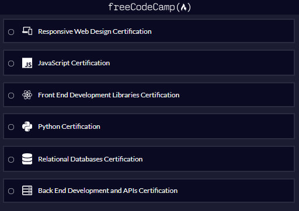

# (🔥) freeCodeCamp


[freeCodeCamp](https://www.freecodecamp.org/) is a nonprofit organization that offers a comprehensive, self-paced web development curriculum. And this repository contains _workshops_, _labs_, and _projects_ completed in their Certified Full Stack Developer Curriculum.



## 📂 Repository Structure

The code is organized by certification path:

| Directory | Certification | Status |
| :--- | :--- | :--- |
| `/webdesign` | Responsive Web Design | ✅ Completed |
| `/javascript` | Javascript | 🚧 In Progress |
| `/frontend` | Front End Development Libraries | 🚧 In Progress |
| `/python` | Python | 🚧 In Progress |
| `/database` | Relational Database | ⏳ Pending |
| `/backend` | Backend Development and APIs | ⏳ Pending |

## 🛠️ Technologies Used

* **Languages:** HTML5, CSS3, JavaScript, Python, SQL
* **Libraries/Frameworks:** React, Redux, Bootstrap, jQuery, Sass/SCSS, D3.js, Express.js
* **Tools:** Git, VS Code, Node.js, MongoDB, PostgreSQL, npm, Vite

## 🌟 Featured Projects

Here are the certification projects in the track:

### 1. Survery Form (HTML)
- **Description:** A simple form webpage to demostrate the some key learning which includes: _`form` elements_, _`input`_, _`label`_, _`select`_, _`fieldset`_, and other tags.
- **Demo:**

### 2. Page of Playing Cards (CSS)
- **Description:** 
- **Demo:** 

## 🚀 How to Run locally

1.  Clone the repository:
    ```bash
    git clone https://github.com/jjokah/freecodecamp.git
    ```
2.  Navigate to the project folder:
    ```bash
    cd webdesign/html/01_basic_html
    ```
3.  Open `any-file.html` in your browser.

## 📝 Notes

This repository is primarily for personal learning and reference. Code may not always follow best practices as it represents learning process at different stages.

I'd advise you follow the [freeCodeCamp](https://www.freecodecamp.org/learn) curriculum on your own to get the most out of it.